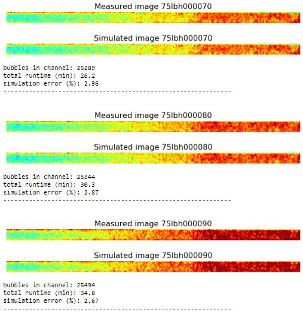
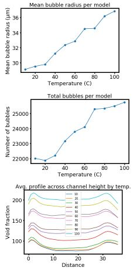

# Fluid channel modeling

This repository contains files for Python-based modeling of void fraction in microfluidic channels. Different methods are used:

1. modeling all bubbles as elongated ellipses by populating each cross-sectional slice of the image with ellipses (**_channel_modeling_cross_sections.ipynb_**)
2. modeling all bubbles as spheres (**_channel_modeling_spheres.ipynb_**)


## Channel modeling of cross sections

This method assumes that bubbles can take the shape of elongated ellipses which stretch along the length of the channel, and that bubbles which come in contact with each other may coalesce into larger single bubbles. 

### Workflow

Description of the worklow:

1. Image data is stored inside the *\data* directory.
2. The Python notebook *channel_modeling.ipynb* crops the images in the *\data* directory to remove regions outside the channel area.
3. The trimmed image data is saved to numpy file called *model_info.npy*.
4. The Python notebook *cross_section_modeling.ipynb* then reads in the trimmed image data.
5. Each image is split into columns of pixels, where each column of pixels represents a single cross section of the image.
6. The initial image cross section (first column of pixels) is populated with elliptical bubbles. The bubbles are allowed to change shape and size using Monte Carlo methods to find a configuration of simulated bubbles which matches the void fraction cross section of the image.
7. Each pixel column (cross section) of the image is iterated over and bubbles are allowed to change shape and size by 5% from their positions in the previous column, until each cross section in the entire image is populated with bubbles.
8. Finally, the entire simulated image is reconstructed using all the ftted bubble parameters, and void fraction map of the simulated bubbles is compared to the measured image.

### Modeling method

Bubbles are constructed by stacking elliptical cross sections. Each bubble cross section is parameterized by 4 descriptors:
* **_x_**: x-position of the elllipse center
* **_y_**: y-position of the elllipse center
* **_rx_**: radius of the ellipse in the x-direction
* **_ry_**: radius of the ellipse in the y-direction


## Channel modeling of spheres

This method models bubbles in the channel as spheres which are placed using Monte Carlo methods.

### Workflow

Description of the worklow:

1. Image data is stored inside the *\data* directory.
2. The Python notebook *channel_modeling.ipynb* crops the images in the *\data* directory to remove regions outside the channel area.
3. The trimmed image data is saved to numpy file called *model_info.npy*.
4. The Python notebook *channel_modeling.ipynb* then performs Monte Carlo modeling of possible bubble configurations inside the channel to attempt to reconstruct the measured images.
5. Parameters of the model are saved to the *model_info.npy* file.
5. The individual channel models created by *channel_modeling.ipynb* are saved as Python dictionaries in the *\models* directory.
6. The Python notebook *model_visualization.ipynb* opens each model from the *\models* directory, reads model parameters from the *model_parameters.npy* file, and extracts statistics from the models.

The modeling results are saved and read from file so that any step in the workflow can be executed without restarting the entire process.

### Modeling method

Modeling of the bubble populations is carried out by Monte Carlo method. An simulated channel which is empty of bubbles (void fraction = 0) is created. Then bubbles with stochastic position and radii are added to the channel until the void fraction of the simulated channel is within a threshold percent difference of the void fraction in the measured images. Limits of bubble radii and positions are set by the user and constrained by the channel dimensions. This information is contained in the *model_info.npy* file.


### Reading saved model information

The model information is written to file in binary format and can be read back into Python as a dictionary using:
```python
import numpy as np
model_filename = 'model_info.npy'
m = np.load(model_filename, allow_pickle=True)[()]
```


### Description of models

Each model in the *\models* directory is a Python dictionary saved as a numpy *.npy* binary file, which contains the following information:
* **label**: (filename) of the original channel image
* **img_model**: simulated channel image
* **img_voidfrac**: measured void fraction image
* **cent**: the centers of the simulated bubbles, in ordered pairs (x, y)
* **rad**: the radii of the simulated bubbles
* **percent_error**: total percent error between the measured channel image and the simulated channel image


## Description of files and directories

* **data**: directory which holds original neutron image data
* **img**: directory which holds images for the Git repository
* **models**: directory for holding all calculated model files
* **channel_modeling.ipynb**: Jupyter Notebook which crops raw data and calculates channel models
* **model_visualization.ipynb**: Jupyter Notebook which reads completed model files for extraction of statistics and visualization of model results
* **model_info.npy**: numpy file which holds cropped image data and information about basic model parameters
* **README.md**: this README file


## Examples
Shown below is an example of void fraction images and simulated model images.





Shown below are plots of model statistics which summarize bubble populations.



